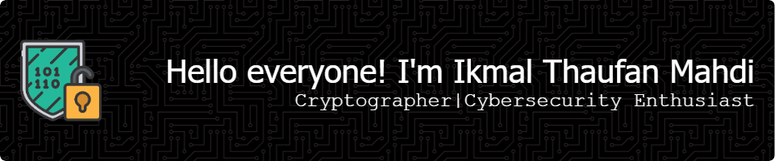

  

# 💫 About Me:
I am a cybersecurity enthusiast and passionate about cryptography which makes me very interested in digital resilience, privacy, and systems that don't require trust.  My goal is to create secure technologies from design to practice so that everyone can protect what matters most to them: freedom, identity, and information.

# 💻 Tech Stack:
     
     
  

# ⚙️ Tools & Frameworks
   
  -3DDC84?style=for-the-badge&logo=android&logoColor=white)  
      
    

# 📚 Education
  

# 📊 GitHub Stats:
 
 

## 🏆 GitHub Trophies

### 🔝 Top Contributed Repo

### 💸 Donate 4 Me
     
   
  

---

<!-- Proudly created with GPRM ( https://gprm.itsvg.in ) -->

###

###
